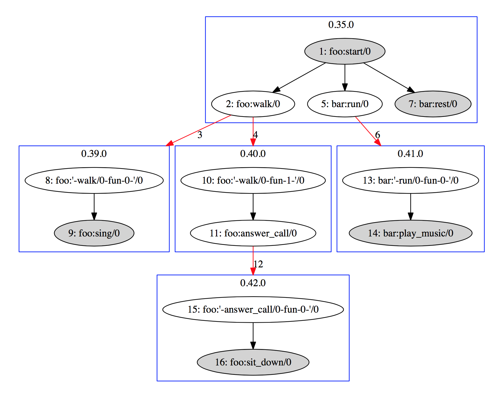

## ECG User's Guide

ECG is an **E**rlang function **C**all graph **G**enerator, which draws function calls and process spawns automatically. ECG utilizes Erlang's powerful trace mechanism and the visualization tool `graphviz`, make sure you have `graphviz` installed, and since Python binding is used here, you also need `Digraph` package installed. The graph generation flow is as follows:

```
Start tracer -> Start program -> Stop trace -> Analyze trace binary -> Draw graph
```

##### Usage

For a simple usage, compile `tracer.erl` and add `tracer.beam` to Erlang's code load path together with your program. And specify the modules you want to trace and trace mode: `global` or `local` which means global or local function calls to trace, then start you program, and stop trace at where you want to end analysis, then parse trace binary and finally draw the graph.

##### Demo

Suppose we want to draw the graph for modules in `demo` directory, we can do following steps:

###### Compile

``` shell
# Go to demo directory
mkdir ebin
erlc -o ebin *.erl ../tracer.erl
erl -pa ebin
```

###### Trace

```Erlang
%% Trace modules foo and bar in local mode
tracer:trace("trace.bin", [foo, bar], local).
foo:start().
%% Stop trace when you want to
tracer:stop().
tracer:analyze("trace.bin", "trace.txt").
```

###### Draw

```Python
python ../draw.py trace.txt
```

Finally, we get the graph:



In the graph, we can see that every function call and process spawn is tagged by a sequence number which means the execution order. Each process is sperated by a blue rectangle in which inner function calls are grouped. The red arrows connecting the rectangles mean the process spawn.


